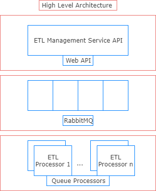

# ETL Workflows 
  

[ETL Workflows](https://github.com/g-tourkogiorgis/ETLWorkflows/wiki) is a lightweight .NET framework for building simple [ETL](https://en.wikipedia.org/wiki/Extract,_transform,_load) processes that builds upon Microsoft's [TPL Dataflow](https://docs.microsoft.com/en-us/dotnet/standard/parallel-programming/dataflow-task-parallel-library) library.  

#### How and why this project was created?

I am a big fan of the [Dataflow programming paradigm](https://en.wikipedia.org/wiki/Dataflow_programming) (when appropriate), and one day a new ticket came in for our team, 
to implement several ETL processes. 
I though, that this was the perfect use case for introducing to the rest of the team the TPL Dataflow library.
In order to make it a bit simpler, I decided to create a reusable abstraction over this library, so that the team has its first exposure to this powerful tool and the new way of thinking in flows, 
so we could use TPL Dataflow later on by itself.

Because this library was written to fit specific needs, some important design decisions were made along the way. 
**It’s not, by any means, a total abstraction of the TPL Dataflow or a full framework for managing complex data flows**. 
It is implemented in a specific way, that meets specific requirements, and **serves demonstration purposes**.  
Having said that, you might find this framework very usefull in case of simple ETL workflows.

**If you are an advanced TPL Dataflow (or similar, Akka.Net, etc.) user, then probably you don't need ETLWorkflows.**  But, your feedback is more than welcome 😊

## Installation
- **NuGet**: The package is available on NuGet. You can view the NuGet [package page](https://www.nuget.org/packages/Ioannis.ETLWorkflows.SDK/) for more details.
- **Console Package Manager**: `Install-Package Ioannis.ETLWorkflows.SDK -Version version-number` and replace `version-number` with the version number you want.

## Quick start

1. Create a class that represents your ETL workflow.
2. Subclass your workflow to inherit from `ETLWorkflows.SDK.ETLWorkflowBase`.
3. Implement the abstract methods for your Extract, Transform and Load [steps](https://github.com/g-tourkogiorgis/ETLWorkflows/blob/b75374d40b54fed18b35f1f6a9d7fa94e3b1d10e/ETLWorkflows.SDK/ETLWorkflowBase.cs#L122).
4. Optionally, implement the [hook methods](https://github.com/g-tourkogiorgis/ETLWorkflows/blob/b75374d40b54fed18b35f1f6a9d7fa94e3b1d10e/ETLWorkflows.SDK/ETLWorkflowBase.cs#L148).
5. Implement the abstract method `FeedProducerAsync`.
6. From your client (usually the Main method of a Console application) call the `StartWorkflowAsync` method on your workflow class.

Intellisense will help you a lot, as methods are well documented.  

## Triggering the flow
Every flow has 3 steps. Extract (E), Transform (T) and Load (L), each having an abstract method ready to be overridden and implemented that run in the following order: 

E -> T -> L

Before the ETL steps run though, the workflow should be triggered somehow. So, the steps are more like: 

(FeedProducerAsync) -> E -> T -> L

Triggering the flow happens at the FeedProducerAsync method. This is the place you write your code for sending messages to the first step of the flow and you can have different implementation depending on your scenario. For example, you can send a finite number of messages, or keep sending messages while a condition is met. See the following section for the approach we took.
TriggerRequest is the model used when triggering the flow, and you can pass in any “outer” information you may need into the flow through its Payload property

## How we trigger: A Microservice approach for triggering
You can implement your triggering logic for your workflow in a way that fits better to your requirements. 
In our case, we took a microservice approach, implementing a producer-consumer scenario with a Web API and a Message Broker ([RabbitMQ](https://www.rabbitmq.com/)). The high-level architecture is shown below: 

You can find a starter template for this approach in Ioannis.ETLWorkflows.Triggers.ETLManagementService.API project.
## License
ETL Workflows is licensed under the [GNU General Public License v3.0](https://github.com/g-tourkogiorgis/ETLWorkflows/blob/master/LICENSE) license.